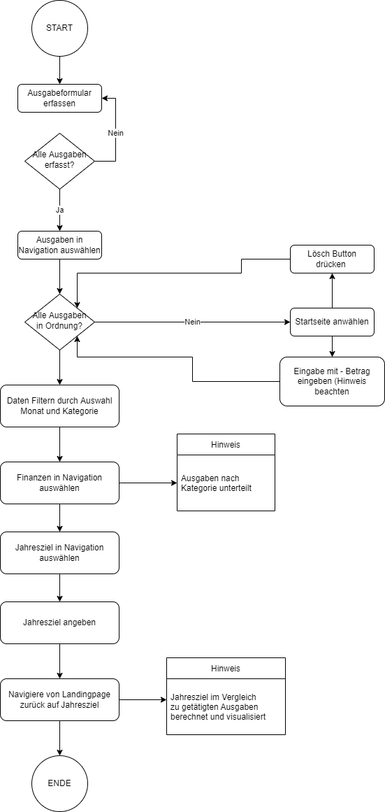

<h1>Webapplikation "FINAZUBI"</h1>
<h2>1. Ausgangslage</h2>
Ausgaben sind schwierig zu kontrollieren und zu kategorisieren. Es gibt eine Zunahme in der Anzahl an Konten, da 
Onlinebanken (Revolut, Swissbankers etc.) und auch Tradingplattformen (Etoro, Binance etc.) nicht über die (Haus)Bank abgewickelt werden. 

<h2>2. Projektidee </h2>
Der FINAZUBI (Finanzen + Azubi) hilft dir dabei, deine kompletten Ausgaben zu dokumentieren und auszuwerten. 
Dabei spielt es keine Rolle, mit welcher Bank du deine Ausgaben tätigst. Berücksichtigt dabei werden verschiedene
Kategorien, die dir zu einem späteren Zeitpunkt zeigen, wo du wieviel Geld ausgegeben hast. Das schafft Sparpotential.
Zudem wird auf die Einnahmen bewusst verzichtet, da der FINAZUBI Hersteller der Meinung ist, dass wenn man erkennt,
dass man mehr Einnahmen hat, auch mehr Ausgaben tätigt. Das wollen wir bewusst verhindern.

<h2>3. Betrieb</h2>
Folgende Module müssen für den Betrieb implementiert werden:
Flask (Flask, render_template, request, os.path, url)
Plotly (plotly.express as px)
JSON
Pandas

<h2>4. Workflow</h2>

<h2>5. Architektur</h2>
Die Architektur ist unterteilt in Startseite, Ausgaben, Finanzen & Jahresziel
Wenn noch keine Daten eingegeben wurden, funktioniert das Programm trotzdem 
und zeigt auf verschiedenste Art und Weise an, dass Daten fehlen.

<h3>5.1 Gefilterte Ausgaben ansehen / Index </h3>
Der User erhält auf der Startseite als Einstiegspunkt die Möglichkeit, seine Ausgaben einzugeben.
Dabei MUSS er Ausgabensumme, Kategorie und das Datum der Ausgabe auswählen.
Wenn die letzte Ausgabe gelöscht werden will, hat es einen Löschbutton dazu.
Ein Hinweis zeigt dem User, wie er getätigte Ausgaben rückgängig machen kann.

<h3>5.2 Gefilterte Ausgaben ansehen / Ausgaben </h3>
Der User wählt eine Kategorie aus. Als zweite Filteroption wählt er den Monat.
Es zeigt eine geordnete Tabelle an, wo alle Ausgaben aufgezeigt werden (gefilterte Variante).
Falls Einnahmen eingerechnet werden sollten (Zuviel Bezahlung von Rechnungen, Twintgutschriften, falsch getätigte Ausgaben), 
zeigt es diese in grüner Schrift an. Ausgaben sind mit roter Schrift gekennzeichnet.
Zudem werden alle getätigten Ausgaben aufgelistet und können von da aus gelöscht werden.

<h3>5.3 Komplette Ausgaben ansehen / Finanzen </h3>
Diese Seite visualisiert alle Ausgaben. Die Ausgaben werden auf die Kategorie unterteilt
Wenn noch keine Ausgaben getätigt wurden, wird ein Hinweis geschaltet 

<h3>5.4 Jahresziel</h3>
Im Programm wird eine Jahreszahl definiert. Die ganzen Ausgaben werden aufgerechnet und angezeigt. 
Weiter zeigt es an, wieviel noch ausgegeben werden darf, bis das Jahresziel erreicht wurde.
Grüne Anzeige =  > 2/3 vom Jahresziel
Orange Anzeige = 1/3 vom Jahresziel bis 2/3 zum Jahresziel
Rote Anzeige = <1/3 vom Jahresziel
Das die Anzeigefarben dynamisch sind, wurden sie nicht in fixe Zahlen, sondern in Relation zum Jahresziel gesetzt.
Wenn noch kein Jahresziel definiert wurde, wird dies in einer Hinweisbox signalisiert

<h2>6. Funktionen</h2>
Dateneingabe: Ausgaben hinzufügen / Kategorie hinzufügen / Datum hinzufügen
Datenspeicherung: Ausgaben aus Dateneingabe werden in einer JSON-Datei gespeichert.
Datenverarbeitung: Die Daten werden zusammengerechnet und gefiltert in Ausgaben.html, Kategorie und Jahresziel (Mit Jinja und Python)
Datenlöschung: Das letzte Element kann mittels eines Formularbuttons gelöscht werden
Datenausgabe: Nach Filterwunsch werden Daten ausgegeben
    Ausgabe nach Monat und Kategorie (Ausgabe)
    Ausgabe nach Genre (Finanzen)
    Ausgabe nach Jahresziel berechnet (Jahresziel)